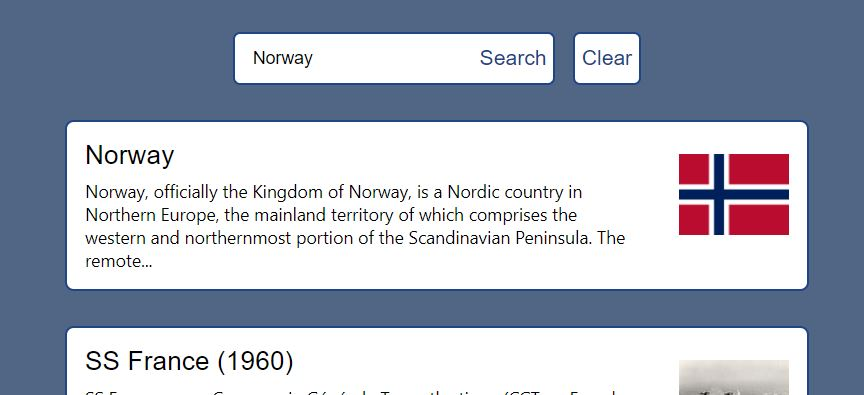

# Wiki Search

This project was bootstrapped with [Create React App](https://github.com/facebook/create-react-app).

## Available Scripts

In the project directory, you can run:

### `npm start`

Runs the app in the development mode.\
Open [http://localhost:3000](http://localhost:3000) to view it in your browser.

The page will reload when you make changes.\
You may also see any lint errors in the console.

### Usage
When opening [http://localhost:3000](http://localhost:3000) on your browser, you can enter a search word and click 
enter or press search to view max 5 articles related to search word, ordered from most popular.

Articles are displayed with title, a summary and an image if there are any main images on the page.

When clicking on an
article, you will be sent to an external wikipedia page, but by going back your search results
will still be there, so you can click on the next article if needed.

### Last version
Last version can be downloaded from [https://github.com/Egzonb92/wiki-search](https://github.com/Egzonb92/wiki-search).

For a limited time, the search will be available on [https://wikisearcheu-js7uqclqxq-lz.a.run.app/](https://wikisearcheu-js7uqclqxq-lz.a.run.app/). (Loading time is slow.)